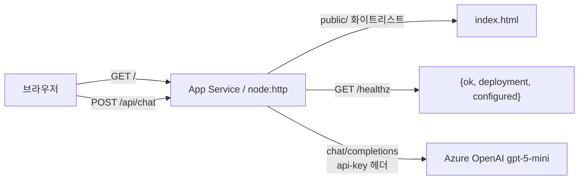

# TRD — righthon

> 기술 설계 (Source of Truth). 제품 요구사항은 [`PRD.md`](./PRD.md).
> 작성: 2026-08-22 07:50. 코드와 어긋나는 문장은 쓰지 않는다.

**라이브:** https://righthon-hale.azurewebsites.net

## 1. 스택과 리소스 (이미 생성됨 — 재생성 금지)

| 층 | 선택 | 비고 |
|---|---|---|
| 호스팅 | Azure App Service Linux, **B1 Basic + alwaysOn**, koreacentral | 웹앱 `righthon-hale`, 플랜 `asp-matdathon`, RG `rg-matdathon` |
| 런타임 | `NODE:22-lts` | `package.json` engines `node>=20`, 의존성 **0개** |
| 서버 | `node:http` 단일 프로세스 `server.js` | 정적 + `POST /api/chat` + `GET /healthz` |
| 프론트 | `public/index.html` 인라인 JS | 빌드 없음. `POST /api/chat`만 호출 |
| 모델 | Azure OpenAI `gpt-5-mini` | 계정 `aif-matdathon-hale`, api-version `2025-04-01-preview` |

자격증명은 App Service 애플리케이션 설정 6개에만 있다: `AZURE_OPENAI_ENDPOINT` `AZURE_OPENAI_KEY` `AZURE_OPENAI_DEPLOYMENT` `AZURE_OPENAI_API_VERSION` `SCM_DO_BUILD_DURING_DEPLOYMENT=false` `WEBSITE_NODE_DEFAULT_VERSION=~22`. **값을 이 문서·로그·프론트에 적지 않는다.**

## 2. 아키텍처



요청은 무상태다. 대화 히스토리·DB·세션 없음. 시스템 프롬프트 + 이번 `message` 한 건만 모델로 간다.

## 3. 컴포넌트 책임

| 경로 | 책임 |
|---|---|
| `public/index.html` | textarea·버튼·결과 영역. `fetch('/api/chat', { signal: AbortSignal.timeout(65000) })`. 키 없음 |
| `server.js` | 라우팅, JSON 검증, 본문 1MB 상한, Azure OpenAI 프록시(`AbortSignal.timeout(60000)`), `public/` 정적 서빙, `/healthz` |
| `package.json` | `start=node server.js`, `dependencies: {}` |
| `deploy.sh` | 화이트리스트 zip(`public` `server.js` `package.json`) → `az webapp deploy` → `/healthz`. 약 40초 |

시스템 프롬프트(서버에만 존재): `너는 사용자의 생산성을 돕는 비서다. 입력을 실행 가능한 항목으로 정리해 한국어로 간결히 답하라.`

## 4. API 명세

### `POST /api/chat`

요청:

```json
{ "message": "내일 보고서 고치고 장보기" }
```

성공 `200`:

```json
{ "reply": "<모델이 정리한 한국어>" }
```

| 코드 | 조건 | body.error |
|---|---|---|
| 400 | JSON 파싱 실패 | `잘못된 JSON` |
| 400 | `message` 없거나 문자열 아님 | `message 필드가 필요합니다` |
| 400 | `Host`가 `new URL`에 불능 (`[`, `a b`, `::::`, `%%%` 등) | `잘못된 요청` |
| 405 | POST가 아님 (예: GET `/api/chat`) | `POST만 허용` |
| 500 | `ENDPOINT` 또는 `API_KEY` 없음 | `서버 설정 누락` |
| 500 | 핸들러 미처리 예외 | `서버 오류` |
| 502 | 업스트림 fetch 실패 | `모델 호출 실패` |
| 502 | 업스트림 `!ok` (상태 코드만 로그, 본문 미전달) | `모델 응답 오류 {status}` |
| 504 | 모델 호출 60초 초과 | `모델 응답 시간 초과` |

본문이 **1MB를 넘으면** `req.destroy()` 로 연결만 끊는다. JSON 에러 바디를 보내지 않는다.

프론트는 `res.ok`이면 `data.reply`, 아니면 `오류 {status}: {error}` 를 결과 영역에 그린다. `TimeoutError`/`AbortError`면 "응답 시간이 초과됐습니다."

### `GET /healthz`

```json
{ "ok": true, "deployment": "gpt-5-mini", "configured": true }
```

`configured` = `ENDPOINT`와 `API_KEY`가 모두 있는지. 메서드 제한 없음(경로 일치 시 즉시 JSON).

정적 GET: `public/` 안 파일만. `/` → `index.html`. 이탈 403, 부재 404. 정적 비GET은 405.

## 5. 설계 결정 (근거)

| ID | 결정 | 근거 (실측) |
|---|---|---|
| D1 | **App Service. Static Web Apps 아님** | 구독 정책 `Allowed resource deployment regions` = `centralindia·uaenorth·koreacentral·indonesiacentral·malaysiawest`. SWA 지원 리전 = `Central US·East US 2·West US 2·West Europe·East Asia`. 교집합 ∅. `az staticwebapp create` → `RequestDisallowedByAzure` |
| D2 | **의존성 0개** | `npm install` 실패가 배포 실패 최다 원인. Node 22 내장 `fetch`로 업스트림 호출 충분. Node 20은 런타임 제공 종료 |
| D3 | **B1 + alwaysOn** | F1은 alwaysOn 불가. 유휴 후 콜드스타트 **27.6초 실측**. 심사 첫 요청이 그 시간에 걸리면 안 된다 |
| D4 | **`max_completion_tokens: 4000`** | `gpt-5-mini`는 `max_tokens`를 거부. 이 한도는 reasoning 토큰까지 깎아서, 낮으면 **HTTP 200 + `content: ""`**. 에러가 아니라 성공이라 프론트·라우팅을 파게 됨 |
| D5 | **정적 루트 = `public/` 화이트리스트** | 루트 서빙 시 `/server.js`가 200으로 소스 노출(실측). denylist가 아니라 "무엇만 내보낼까" |
| D6 | **서버 60초 < 프론트 65초** | 서버가 먼저 끊어 클라이언트가 **504 JSON**을 받는다. 프론트가 먼저 끊으면 브라우저만 타임아웃이고 서버 응답 코드가 없다 |

추가로: GitHub Actions 없음. CI 왕복 2~3분을 피하고 `./deploy.sh` ~40초로 30분마다 링크를 살린다. `az webapp deploy`의 `RuntimeSuccessful`은 zip 전개일 뿐, `/healthz`와 `POST /api/chat` 200(+ 비공백 `reply`)까지가 동작 증명이다.

## 6. 보안

- **키 위치.** Azure OpenAI 키는 서버 환경변수만. 프론트 JS·레포·zip 화이트리스트에 없음. 업스트림 오류 본문은 로그에 남기지 않고 상태 코드만.
- **경로 이탈.** `path.resolve(public, rel)` 후 절대경로가 `public/` prefix가 아니면 **403**. 파일 없으면 **404**.
- **한계 1 — 심볼릭 링크.** `path.resolve`는 `..`를 어휘적으로만 정리하고 **심볼릭 링크를 해석하지 않는다.** `public/` 안 링크가 외부를 가리키면 새어나간다. 현재 정적 자산·업로드가 없어 노출면이 작다. 자산이 붙으면 `fs.realpath` 후 재검사가 필요하다.
- **한계 2 — `%2e%2e`.** 막히는 이유는 prefix 검사 덕이 아니라 **`url.pathname`이 퍼센트 디코딩을 하지 않아서**다. 경로에 `decodeURIComponent`를 씌우면 `..`가 살아나 이탈이 열린다.
- **프로세스 생존.** 망가진 `Host`는 `new URL`이 `TypeError`를 던진다. try/catch로 **400**을 주고 프로세스를 죽이지 않는다.
- **본문 상한.** 1MB. 인증 없음(제품 요구, `PRD.md` §3).

## 7. 배포와 운영

```
./deploy.sh
# zip 화이트리스트 → az webapp deploy -n righthon-hale -g rg-matdathon → sleep 8 → GET /healthz
```

제외 목록(`-x`)을 쓰지 않는다. 새 파일이 조용히 새어나간다. 로그: `az webapp log tail -n righthon-hale -g rg-matdathon`. 키·앱설정 값이 보이면 즉시 중단.

## 8. 품질 보증 (실측)

| 항목 | 결과 |
|---|---|
| 경로 이탈 7종 `..` `%2e%2e` `..%2f` `%252e` `..;` `//` `....//` | 소스 미노출. 코드: prefix 실패 403, 부재 404 |
| 소스 노출 `/server.js` `/package.json` `/deploy.sh` `/README.md` | 전부 **404** (`public/` 밖) |
| 망가진 Host `[` `a b` `::::` `%%%` | **400**, 프로세스 생존 |
| 잘못된 JSON / `message` 타입 | **400** |
| `GET /api/chat` | **405** |
| 로그에 자격증명 | **0건** |
| 종단 `POST /api/chat` | **200** + 한국어 `reply` 비공백 |

## 9. 알려진 한계 / 트레이드오프

- 기능 1개, 무상태, 멀티턴·저장 없음 (`PRD.md` §6).
- 1MB 초과는 JSON 에러가 아니라 연결 종료.
- `/healthz`는 메서드를 가리지 않는다.
- B1는 F1보다 비용이 있다. 심사 첫 요청 타임아웃을 콜드스타트 비용과 바꾼 것이다.
- 모델 빈 `content`는 HTTP 200으로 내려온다. 프론트는 `(빈 응답)`으로 표시한다. D4의 한도(4000)가 그 확률을 낮춘다.
- 이 구독에서는 SWA로 되돌릴 수 없다 (D1).

## 변경 이력

| 시각 | 내용 |
|---|---|
| 2026-08-22 07:50 | 초안. 구현 1기능·실측 근거 반영. |
